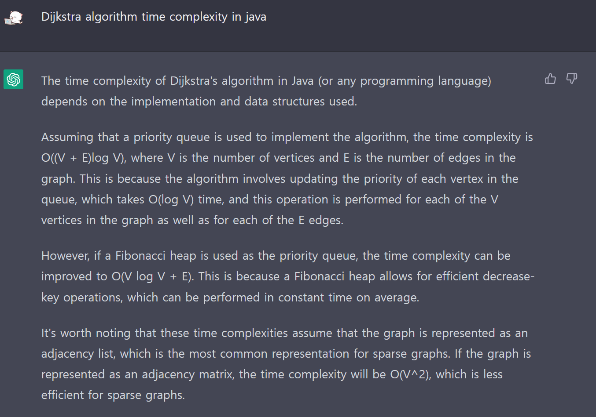

# 우선순위 큐

일반적인 큐의 모습과 유사하다.

큐에 해당하는 각 원소에 "우선순위" 라는 값이 추가된 것 뿐인데 그렇기 때문에 우선순위 값과 실제 원소의 값을 가지고 있을 수 있는 새로운 타입이 필요하다.

```java
class Solution {

    // Node
    static class Node {

        int data;

        // Lower values indicate higher priority
        int priority;
        Node next;

    }

    static Node node = new Node();

    // Function to Create A New Node
    static Node newNode(int d, int p) {
        Node temp = new Node();
        temp.data = d;
        temp.priority = p;
        temp.next = null;

        return temp;
    }

    // Return the value at head
    static int peek(Node head) {
        return (head).data;
    }

    // Removes the element with the
// highest priority from the list
    static Node pop(Node head) {
        Node temp = head;
        (head) = (head).next;
        return head;
    }

    // Function to push according to priority
    static Node push(Node head, int d, int p) {
        Node start = (head);

        // Create new Node
        Node temp = newNode(d, p);

        // Special Case: The head of list has lesser
        // priority than new node. So insert new
        // node before head node and change head node.
        if ((head).priority < p) {

            // Insert New Node before head
            temp.next = head;
            (head) = temp;
        } else {

            // Traverse the list and find a
            // position to insert new node
            while (start.next != null &&
                start.next.priority > p) {
                start = start.next;
            }

            // Either at the ends of the list
            // or at required position
            temp.next = start.next;
            start.next = temp;
        }
        return head;
    }

    // Function to check is list is empty
    static int isEmpty(Node head) {
        return ((head) == null) ? 1 : 0;
    }

    // Driver code
    public static void main(String args[]) {
        // Create a Priority Queue
        // 7.4.5.6
        Node pq = newNode(4, 1);
        pq = push(pq, 5, 2);
        pq = push(pq, 6, 3);
        pq = push(pq, 7, 0);

        while (isEmpty(pq) == 0) {
            System.out.printf("%d ", peek(pq));
            pq = pop(pq);
        }

    }
}


```

직접 Java로 구현한다면 위와 같은데 특별한 점은 위에서 언급했듯이

우선순위라는 값을 새로 추가해주는 것이다.

하지만 저걸 일일히 구현하기엔 좀 그러니 실제로 사용하는 방법은 다음과 같다.

```java
import java.util.PriorityQueue;
import java.util.Collections;

//낮은 숫자가 우선 순위인 int 형 우선순위 큐 선언
PriorityQueue<Integer> priorityQueueLowest = new PriorityQueue<>();

//높은 숫자가 우선 순위인 int 형 우선순위 큐 선언
PriorityQueue<Integer> priorityQueueHighest = new PriorityQueue<>(Collections.reverseOrder());
```

## 시간복잡도

| 행위            | 복잡도      |
|---------------|----------|
| offer(insert) | O(log n) |
| poll(pop)     | O(log n) |
| peek(get)     | O(1)     |
| size          | O(1)     |

- Null을 허용하지 않는다.

---

# 다익스트라 알고리즘

각 모든 노드까지의 최단거리를 구하는 알고리즘이다.

## 동작 원리 (Priority Queue + Greedy + DP)

- 방문하지 않은 노드 중에서 가장 비용이 적은 노드를 선택한다. (Greedy)

- 갱신하는 주변 노드의 값에 대해서만 다음 최소 비용을 갖는 노드를 선택해주면 된다는 것이 우선순위큐를 이용하는 것의 핵심이다.

- 해당 노드로부터 갈 수 있는 노드들의 비용을 갱신한다. (DP)

## 구현

```java
import java.util.ArrayList;
import java.util.Scanner;

/*
sample input
5 6
1
5 1 1
1 2 2
1 3 3
2 3 4
2 4 5
3 4 6
 */

// 도착 지점과, 도착지점으로 가는 비용을 의미하는 클래스를 정의한다.
class Node {
	int idx;
	int cost;

	// 생성자
	Node(int idx, int cost) {
		this.idx = idx;
		this.cost = cost;
	}
}

public class Dijkstra {
	public static void main(String[] args) {
		Scanner sc = new Scanner(System.in);
		// 노드와 간선의 개수
		int V = sc.nextInt();
		int E = sc.nextInt();
		// 출발지점
		int start = sc.nextInt();

		// 1. 인접리스트를 이용한 그래프 초기화
		ArrayList<ArrayList<Node>> graph = new ArrayList<ArrayList<Node>>();
		// 노드의 번호가 1부터 시작하므로, 0번 인덱스 부분을 임의로 만들어 놓기만 한다.
		for (int i = 0; i < V + 1; i++) {
			graph.add(new ArrayList<>());
		}
		// 그래프에 값을 넣는다.
		for (int i = 0; i < E; i++) {
			// a로 부터 b로 가는 값은 cost이다.
			int a = sc.nextInt();
			int b = sc.nextInt();
			int cost = sc.nextInt();

			graph.get(a).add(new Node(b, cost));
		}

		// 2. 방문 여부를 확인할 boolean 배열, start 노드부터 end 노드 까지의 최소 거리를 저장할 배열을 만든다.
		boolean[] visited = new boolean[V + 1];
		int[] dist = new int[V + 1];

		// 3. 최소 거리 정보를 담을 배열을 초기화 한다.
		for (int i = 0; i < V + 1; i++) {
			// 출발 지점 외 나머지 지점까지의 최소 비용은 최대로 지정해둔다.
			dist[i] = Integer.MAX_VALUE;
		}
		// 출발 지점의 비용은 0으로 시작한다.
		dist[start] = 0;

		// 4. 다익스트라 알고리즘을 진행한다.
		// 모든 노드을 방문하면 종료하기 때문에, 노드의 개수 만큼만 반복을 한다.
		for (int i = 0; i < V; i++) {
			// 4 - 1. 현재 거리 비용 중 최소인 지점을 선택한다.
			// 해당 노드가 가지고 있는 현재 비용.
			int nodeValue = Integer.MAX_VALUE;
			// 해당 노드의 인덱스(번호).
			int nodeIdx = 0;
			// 인덱스 0은 생각하지 않기 때문에 0부터 반복을 진행한다.
			for (int j = 1; j < V + 1; j++) {
				// 해당 노드를 방문하지 않았고, 현재 모든 거리비용 중 최솟값을 찾는다.
				if (!visited[j] && dist[j] < nodeValue) {
					nodeValue = dist[j];
					nodeIdx = j;
				}
			}
			// 최종 선택된 노드를 방문처리 한다.
			visited[nodeIdx] = true;

			// 4 - 2. 해당 지점을 기준으로 인접 노드의 최소 거리 값을 갱신한다.
			for (int j = 0; j < graph.get(nodeIdx).size(); j++) {
				// 인접 노드를 선택한다.
				Node adjNode = graph.get(nodeIdx).get(j);
				// 인접 노드가 현재 가지는 최소 비용과
				// 현재 선택된 노드의 값 + 현재 노드에서 인접 노드로 가는 값을 비교하여 더 작은 값으로 갱신한다.
				if (dist[adjNode.idx] > dist[nodeIdx] + adjNode.cost) {
					dist[adjNode.idx] = dist[nodeIdx] + adjNode.cost;
				}
			}
		}

		// 5. 최종 비용을 출력한다.
		for (int i = 1; i < V + 1; i++) {
			if (dist[i] == Integer.MAX_VALUE) {
				System.out.println("INF");
			} else {
				System.out.println(dist[i]);
			}
		}
		sc.close();
	}
}
```

## 다익스트라 알고리즘 시간 복잡도 (우선순위 큐 이용)




- Priority Queue를 사용하여 구현한다면 시간 복잡도는 O((V + E)log V)이다.
  - V는 정점의 수이고 E는 그래프 간선의 수이다.

- 피보나치 힙을 우선순위 큐로 사용하면 시간복잡도를 O(VlogV + E)로 개선할 수 있다.